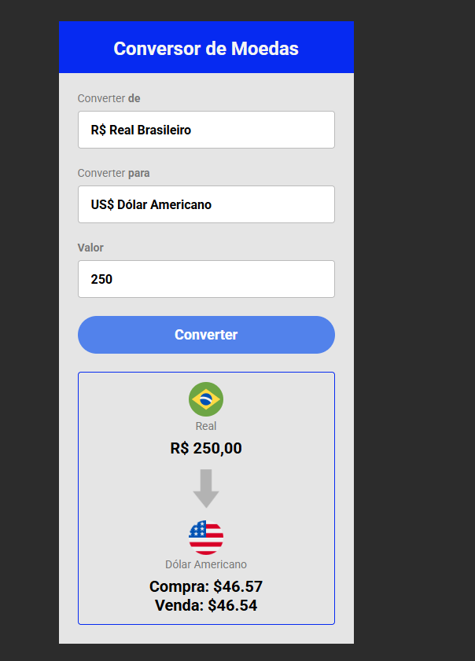

# Conversor de Moedas



## 🎯 Sobre

O **Conversor de Moedas** é uma aplicação web simples e intuitiva que permite aos usuários converter valores do Real Brasileiro (BRL) para outras moedas, incluindo Dólar Americano (USD), Euro (EUR) e Bitcoin (BTC). As taxas de câmbio são obtidas em tempo real através de uma API, garantindo que os valores de compra e venda sejam sempre atuais.

---

## ✅ Funcionalidades

-   Conversão de Real (BRL) para Dólar Americano (USD), Euro (EUR) e Bitcoin (BTC).
-   Cotações atualizadas em tempo real a cada nova conversão.
-   Exibição dos valores de compra e venda para Dólar e Euro.
-   Interface amigável que exibe as bandeiras e os nomes das moedas.
-   Atualização dinâmica da interface ao trocar a moeda de destino.

---

## 🛠️ Tecnologias Utilizadas

-   HTML5
-   CSS3
-   JavaScript
-   API: [Awesome API](https://docs.awesomeapi.com.br/api-de-moedas) para cotações de moedas.

---

## 🚀 Como Utilizar

1.  Clone o repositório:
    ```bash
    git clone https://github.com/seu-usuario/conversor-moedas.git
    ```
2.  Abra o arquivo `index.html` em seu navegador de preferência.
3.  Insira o valor em Reais que deseja converter.
4.  Selecione a moeda para a qual deseja converter.
5.  Clique no botão "Converter" para ver o resultado.

---
